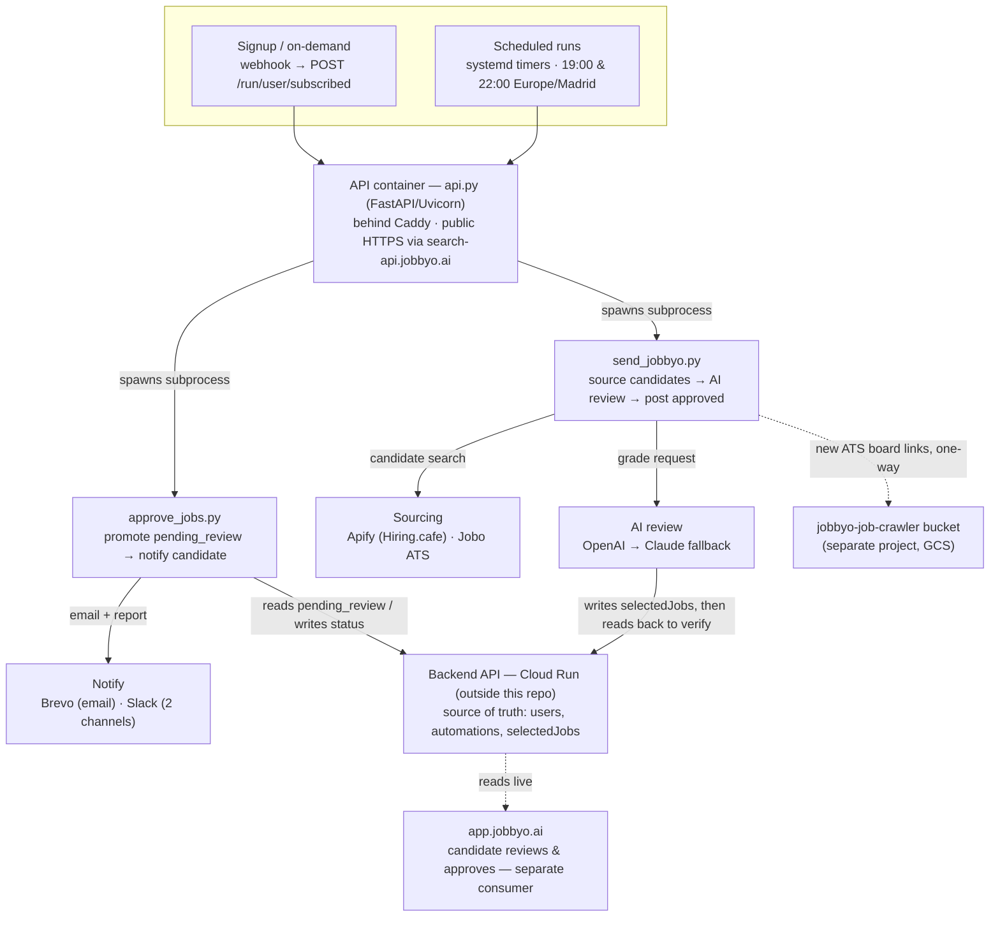

# Architecture

How a paid candidate's daily job matches get found, graded, stored, and delivered — from the two nightly systemd passes to the on-demand webhook path, across every service this pipeline touches.

> Compiled from repo inspection plus a live check of the production host. Two services live outside this repo entirely (the Cloud Run backend and the sibling `jobbyo-job-crawler` project) — treat anything said about them here as current-best-understanding, not documented fact, since neither's source is available from this side.

## How a job reaches a candidate

Two independent triggers — the nightly clock and the signup/on-demand webhook — both land on the same API container. Only `send_jobbyo.py` touches sourcing and AI review; only `approve_jobs.py` touches Brevo/Slack; both write back to the one backend the app itself reads from independently.

## The daily schedule

| Time (Europe/Madrid) | Pass | What runs | Notes |
|---|---|---|---|
| **19:00** | Pass 1 — build the queue | `first_round`, plus automatic `second_round` / `minimum_viable` rounds if a user is still short | Retries every 5 min on failure |
| **22:00** | Pass 2 — top-up + report | Another top-up pass, then the Slack coverage % | No email sent from this pass |
| *(no fixed time)* | Subscribe / manual top-up | `POST /run/user/subscribed`, `POST /run/user/top-jobs` | Fires on signup or a manual request; blocks until done (up to 10 min); 24h cooldown per user |
| *(manual only)* | Daily digest promotion | `approve_jobs.py` / `POST /email/all` | Not on the timer — still a deliberate, hand-triggered step |

Both nightly passes are driven by `scripts/run_full_cycle.sh`, which polls the API's `/run/status` until the run finishes and posts to Slack (`SLACK_WEBHOOK_URL_DAILY_RUN`) on any failure, including the API being unreachable.

## Component reference

| Component | Role | Triggered by | Talks to |
|---|---|---|---|
| `send_jobbyo.py` | Sources candidates, AI-reviews them, posts approved jobs, verifies the write stuck | API container, or directly via CLI | Apify, Jobo, OpenAI/Claude, Backend API, `company_ingestion.py` |
| `approve_jobs.py` | Promotes `pending_review` jobs to plan status, sends the digest email, posts the Slack run report | Manual run / `POST /email/all` | Brevo, Slack (`SLACK_WEBHOOK_URL_USER_DETAILS`), Backend API |
| `company_ingestion.py` | Extracts ATS board links from this run's jobs, feeds new ones into the crawler's GCS bucket, posts a Slack summary of what was added | Called inline by `send_jobbyo.py`; failures are logged, never fatal | Google Cloud Storage, Slack (`SLACK_WEBHOOK_URL_DAILY_RUN`) |
| `api.py` | FastAPI wrapper exposing the pipeline over HTTP | systemd timers, webhook, or manual `curl` | Runs the two scripts above as subprocesses |
| Docker + Caddy + systemd | Keeps the API container alive; Caddy terminates public TLS and reverse-proxies to it; systemd drives the nightly schedule | boot / timers | Docker daemon, Let's Encrypt (ACME) |
| Backend API (Cloud Run) | Source of truth: users, automations, the `selectedJobs` queue | HTTP calls from both scripts | External — not in this repo |
| Sourcing APIs | Supplies candidate jobs | Called by `send_jobbyo.py` | Apify (Hiring.cafe), Jobo ATS, OpenAI web search (exception-only fallback) |
| AI review | Grades each candidate against the user's persona + search contract | Called by `send_jobbyo.py` | OpenAI, automatic fallback to Claude |
| Brevo & Slack | Candidate-facing email + ops reporting | Called by `approve_jobs.py` and the subscribe endpoint directly | — |
| `app.jobbyo.ai` | Where a candidate actually reviews and approves jobs | n/a | Reads the Backend API directly — a peer consumer, not a downstream step of this pipeline |

## Operational notes

Four things worth knowing that aren't visible from the code alone.

- **The API is public now, behind Caddy, not loopback-only.** An earlier version of this pipeline bound the API to `127.0.0.1` specifically because every run can spend real LLM/scraper money and nothing should be able to trigger one from the open internet. That's since changed to a Caddy reverse proxy (`search-api.jobbyo.ai`, auto-TLS) sitting in front of it. If anything calls these routes without its own auth, that protection now lives entirely in Caddy/DNS, not in `api.py` itself — worth confirming there's a gate (shared secret, IP allowlist, etc.) in front of any route that isn't meant to be called by just anyone.

- **`jobbyo-search.service` doesn't self-heal.** It's a systemd oneshot that runs `docker compose up -d` once and stays "active" forever after that. If the container ever dies for a reason other than a reboot, systemd won't re-run it just because a timer depends on it — nothing brings the container back automatically. Check `docker compose ps` directly if a scheduled pass looks like it silently no-op'd; `systemctl is-active` on this unit can say "active" while the container itself is gone.

- **Read-after-write verification exists now, but only client-side.** `api_post_jobs()` in `send_jobbyo.py` reads the candidate's queue back a couple of seconds after every real post and re-tries once if any job is missing, logging loudly (`🔴 VERIFY FAILED`) if it still doesn't stick. This catches the write silently not landing; it does not fix why it can happen in the first place (see below), and it adds a couple of seconds of latency per batch.

- **`jobo_discovery_log/` is dead.** It was the old, file-based way of capturing Jobo board links for the crawler project — no schedule, no cleanup, nobody read it. `company_ingestion.py` replaced it (see above); the directory may still exist on disk from before but nothing writes to it anymore. Gitignored, safe to delete.

- **The backend keeps what looks like a duplicate copy of every user's job list.** A shadow `automation_data.selectedJobs` alongside the real, top-level `selectedJobs` has been seen to reset the live queue to empty shortly after a legitimate write. Root cause is unconfirmed — it lives in the Cloud Run service, entirely outside this repo, so it can't be fixed from here. The verification step above is the mitigation available on this side; if it starts firing regularly, that's a signal to go look at the backend directly rather than re-checking this codebase.
